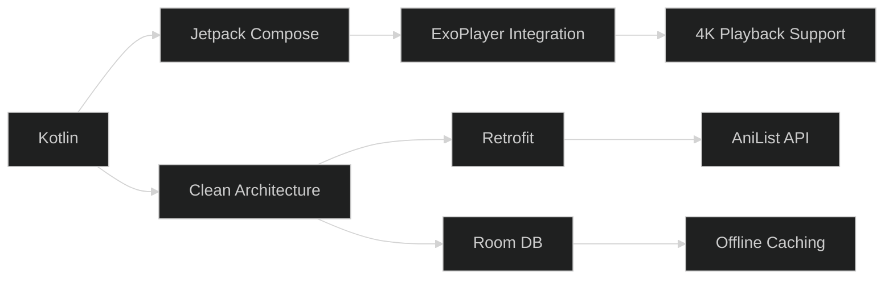

# 🔥 Apex Anime  
### *The Last Ad-Limited Anime App You'll Ever Need*

<div align="center">
  

[](https://www.mediafire.com/file/when8omsb252lko/app-debug.apk/file)
[](https://discord.gg/your-invite-link)
</div>

---

## ✨ Why Apex Anime Stands Out

> _“We took everything you hate about anime streaming... and nuked it from orbit.”_

<div align="center">

| Feature         | 🧟 Other Apps        | 🥷 Apex Anime        |
|-----------------|----------------------|-----------------------|
| **Ads**         | 5–10 per episode     | ✅ Max 2 **per day**  |
| **Tracking**    | Sells your data      | ✅ Zero analytics     |
| **Quality**     | 720p max             | ✅ Native 1080p       |
| **Offline Mode**| Locked behind paywall| ✅ Free downloads     |
| **Accounts**    | Signup mandatory     | ✅ Guest mode enabled |

</div>

---

## 🚀 Features Worth Simping For

### 🛡️ Ad Shield Technology  
> _"We show fewer ads in a week than Crunchyroll shows in one episode."_


---

### 🌌 Weeb-First Design  
```kotlin
// Actual logic inside our player:
fun playEpisode() {
    skipIntroDetector()       // because intros get old
    autoNextEpisode()         // binge responsibly
    adManager.checkDailyLimit() // this is why users love us
}
```

---

## 📲 Install in 10 Seconds Flat

### 👤 Android Users:
```bash
1. Tap this ➜ https://www.mediafire.com/file/when8omsb252lko/app-debug.apk/file
2. Enable "Install Unknown Sources"
3. Launch and start watching
```

### 👨‍💻 Developers:
```bash
git clone https://github.com/Aaryanbanskota/anime-app.git
cd anime-app
./gradlew assembleDebug
```

---

## ⚙️ Tech Stack That Doesn’t Suck



**Secret Sauce**:  
  
  


---

## 👶 My First Project – Please Be Kind

> This is my very first full Android project. While I’ve done my best to squash bugs and keep the user experience smooth, there may still be some hiccups.  
> I'm always learning and improving — your feedback means a lot! 🙏

---

## 📚 Disclaimer & Source

> 🚧 **Disclaimer:** This app is built **for educational purposes only**. It is not affiliated with, endorsed by, or officially connected to any anime content providers.  
>  
> 🔗 **Streaming Source:** This app uses **HiAnime** as its source for streaming content. All rights for the streamed content belong to their respective copyright holders.

---

## 🌟 Roadmap Highlights

- ✅ Alpha Launch — *"It works... mostly"*
- 🔄 MAL/AniList Sync — *Coming Q4 2025*
- 📺 Chromecast Support — *Soon™*
- 🌑 AMOLED Dark Mode — *Save those pixels*

---

## ❓ FAQ

<details>
<summary><b>Q: How is this free with only 2 ads per day?</b></summary>
<br>
A: Black magic. Also: smart caching + efficient servers = happy users.
</details>

<details>
<summary><b>Q: iOS version when?</b></summary>
<br>
A: When Apple chills about sideloading. Until then—Android emulator.
</details>

---

<div align="center">

## 💖 Love This Project?

[](https://github.com/Aaryanbanskota/anime-app/stargazers)  
[](https://github.com/Aaryanbanskota/anime-app/network)

```kotlin
// Final Thought
if (you.readThisFar) {
    println("You're legendary! 🎉")
    startWatchingAnime()
}
```

</div>
